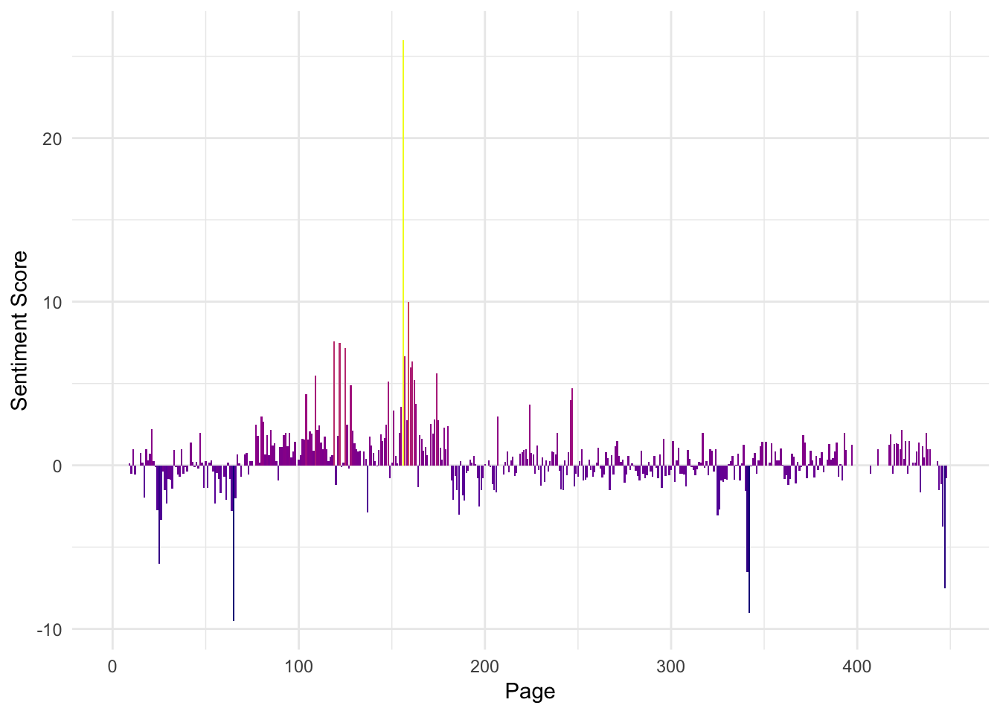
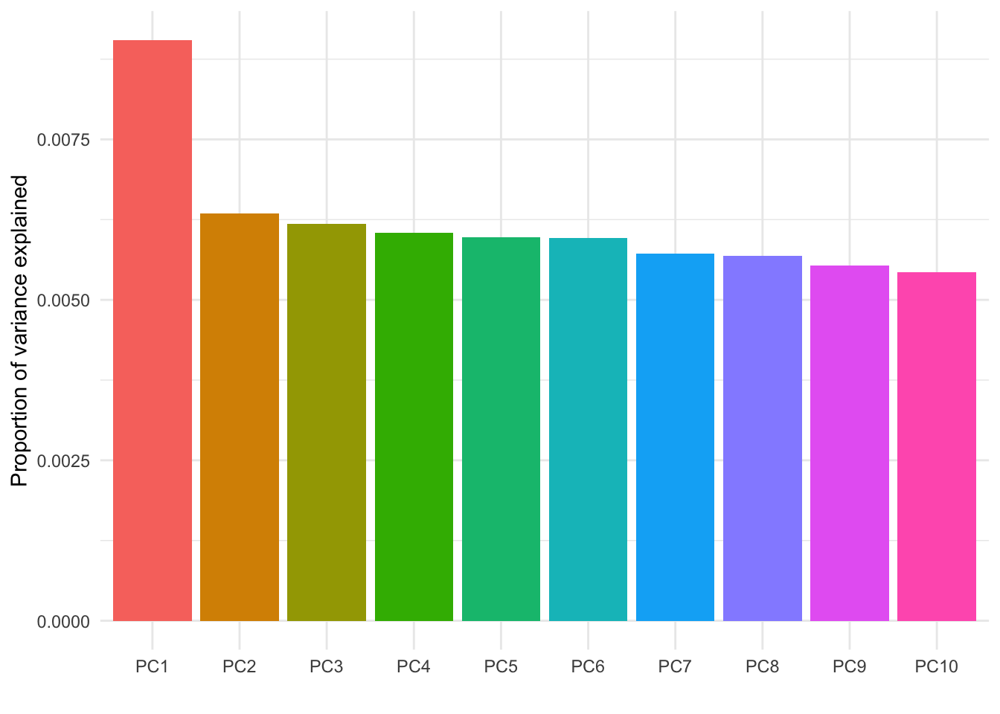

<!-- README.md is generated from README.Rmd. Please edit that file -->

# Mueller Report Text Analysis

<!-- badges: start -->

[](https://www.tidyverse.org/lifecycle/#experimental)
<!-- badges: end -->

This code chunk reads in the text from the report (downloaded as CSV
from [Factbase](https://%20f2.link/mr-sheet)). The Factbase version of
the report has been human-reviewed to fix errors in the OCR process.

``` r
report <- read_csv(
  file = "report.csv",
  col_names = c("page", "text", "definition", "NA"),
  col_types = cols(
    page = col_integer(),
    text = col_character(),
    definition = col_character(),
    `NA` = col_character()
  ),
  skip = 2
)
```

This is what the first few rows of the data looks like:

``` r
report %>%
  head() %>%
  knitr::kable()
```

| page | text                                                                                                                                                                                                      | definition | NA |
| ---: | :-------------------------------------------------------------------------------------------------------------------------------------------------------------------------------------------------------- | :--------- | :- |
|    1 | Report On The Investigation Into Russian Interference In The 2016 Presidential Election Volume I of II Special Counsel Robert S. Mueller, III Submitted Pursuant to 28 C.F.R. § 600.8(c) Washington, D.C. | NA         | NA |
|    1 | March 2019                                                                                                                                                                                                | NA         | NA |
|    2 | \[Blank, Not Redacted\]                                                                                                                                                                                   | NA         | NA |
|    3 | \[Table of Contents\]                                                                                                                                                                                     | NA         | NA |
|    4 | \[Table of Contents\]                                                                                                                                                                                     | NA         | NA |
|    5 | \[Table of Contents\]                                                                                                                                                                                     | NA         | NA |

This code chunk converts the report to a “tidy report” where each row is
a word.

``` r
tidy_report <- report %>%
  select(page, text) %>%
  unnest_tokens(output = word, input = text)

tidy_report %>%
  top_n(10) %>%
  knitr::kable()
#> Selecting by word
```

| page | word       |
| ---: | :--------- |
|  142 | zwaan      |
|  142 | zwaan      |
|  142 | zwaan      |
|  142 | zwaan      |
|  146 | zone       |
|  228 | zubrin     |
|  384 | zivotofsky |
|  384 | zivotofsky |
|  385 | zivotofsky |
|  391 | zone       |
|  410 | zwaan      |
|  448 | zwaan      |

The report has 197,140 words across 448 pages.

### Sentiment analysis

Sentiment analysis refers to estimating the sentiment – the general
positivity or negativity – of a text. Sometimes sentiment analysis is
used to characterize not just positivity/negativity but also other
emotions (such as anger, anticipation, disgust, fear, joy, sadness,
surprise, and trust).

Although the actual sentiment of text depends on the context of tokens,
it is common to simply use a lookup table that maps words to a
pre-identified sentiment. For instance the word “happy” would be given a
positive sentiment score (e.g. +3) and “unhappy” would be given a
negative sentiment score (e.g. -2). This method is easy to implement but
has obvious drawbacks – the sequence of tokens isn’t considered and some
words take on different meaning in different contexts.

This code chuck gets the sentiment of each word using the AFINN lexicon.

``` r
report_sentiment <- tidy_report %>%
  count(page, word) %>%
  left_join(
    y = get_sentiments("afinn"),
    by = "word"
  )
```

The report sentiment score is 0.14 (slightly positive) with a standard
deviation of 1.88 – so the text should probably be considered neutral.

This plot shows the “sentiment score” by each page. The page sentiment
score is calculated as the average (mean) of word scores scaled by their
number of occurences.

``` r
report_sentiment %>%
  group_by(page) %>%
  summarize(
    score = mean(n * score, na.rm = TRUE)
  ) %>%
  ungroup() %>%
  mutate(
    score = coalesce(score, 0)
  ) %>%
  ggplot(aes(x = page, y = score, fill = score)) +
  geom_bar(stat = "identity") +
  scale_x_continuous("Page") +
  scale_y_continuous("Sentiment Score") +
  scale_fill_viridis_c(option = "C") +
  guides(fill = FALSE) +
  theme_minimal()
```



### Principal component analysis

This code chunk converts the tidy report to a sparse matrix with each
row representing a page, each column for the words, and the values being
the term-frequency inverse document-frequency value.

``` r
sparse_word_matrix <- tidy_report %>%
  count(page, word) %>%
  bind_tf_idf(word, page, n) %>%
  cast_sparse(page, word, tf_idf)
```

This code chunk fits a principal components analysis using the sparse
matrix from the previous step.

``` r
words_pca <- irlba::prcomp_irlba(
  x = sparse_word_matrix,
  n = 64,
  scale. = TRUE
)
```

This plot shows the proportion of variance explained by each of the top
10 principal components:

``` r
summary(words_pca)$importance[2,1:64] %>%
  enframe(.) %>%
  mutate(
    name = fct_reorder(factor(name), desc(value))
  ) %>%
  top_n(10) %>%
  ggplot(aes(x = name, y = value, fill = name)) +
  geom_bar(stat = "identity") +
  scale_y_continuous(name = "Proportion of variance explained") +
  scale_x_discrete("") +
  guides(fill = FALSE) +
  theme_minimal()
#> Selecting by value
```



This next code chunk “tidies” the PCA so that each row corresponds to
the contribution of each word to each principal component.

``` r
tidied_pca <- bind_cols(
  word = sparse_word_matrix@Dimnames[[2]],
  broom::tidy(words_pca$rotation)
  ) %>%
  gather(PC, Contribution, PC1:PC64)
#> Warning: 'tidy.matrix' is deprecated.
#> See help("Deprecated")

tidied_pca %>%
  top_n(10) %>%
  knitr::kable()
#> Selecting by Contribution
```

| word          | PC  | Contribution |
| :------------ | :-- | -----------: |
| ae            | PC4 |    0.1224969 |
| ar            | PC4 |    0.1224969 |
| consultations | PC4 |    0.1224969 |
| efflmaton     | PC4 |    0.1224969 |
| er            | PC4 |    0.1224969 |
| fm            | PC4 |    0.1224969 |
| frames        | PC4 |    0.1224969 |
| iegspt        | PC4 |    0.1224969 |
| landan        | PC4 |    0.1224969 |
| meetoy        | PC4 |    0.1224969 |
| ofry          | PC4 |    0.1224969 |
| spore         | PC4 |    0.1224969 |
| te            | PC4 |    0.1224969 |

This plot shows the words with the highest contribution to each of the
top 4 principal components.

``` r
tidied_pca %>%
  mutate(
    word = factor(word)
  ) %>%
  filter(PC %in% paste0("PC", 1:4)) %>%
  group_by(PC) %>%
  top_n(30, abs(Contribution)) %>%
  mutate(word = reorder(word, Contribution)) %>%
  ungroup() %>%
  ggplot(aes(word, Contribution, fill = word)) +
  geom_col(show.legend = FALSE, alpha = 0.8) +
  theme_minimal() +
  theme(
    axis.text.x = element_text(angle = 90, hjust = 1, vjust = 0.5), 
    axis.ticks.x = element_blank()
  ) +
  labs(
    x = "Words",
    y = "Relative importance in principle component"
  ) +
  facet_wrap(~ PC, ncol = 2, scales = "free_y") +
  coord_flip()
```


